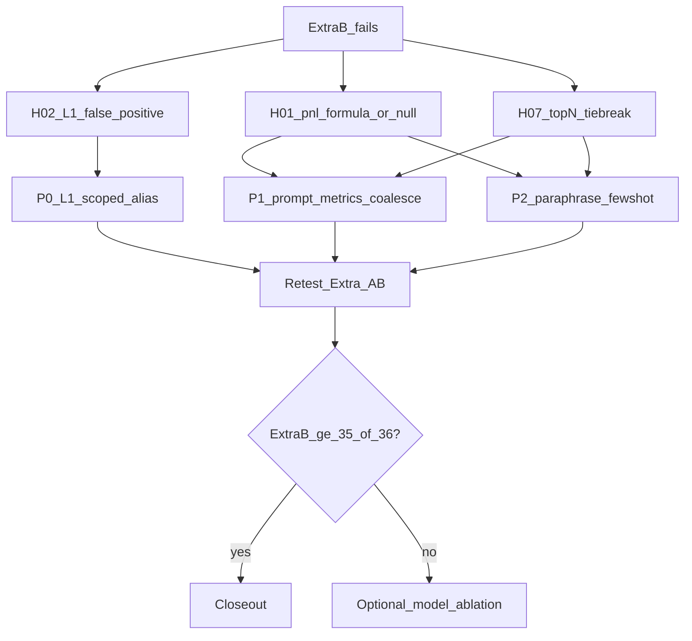

# QueryPilot 阶段四续一：Extra 泛化提准与低延迟优化

> 记录范围：基于 `extra_fast_A_fs3` / `extra_fast_B_fs0`（及对照 `official_fast_noshort_fs3`）的失败与错因，在**不显著增加耗时**前提下完成源码侧提准与泛化加固。  
> 记录时间：2026-08-09  
> 状态：✅ **已收口** — Extra-A/B 关短路均 **36/36**；官方默认 **7/7**；官方关短路仍 **6/7**（case6 金标扇出，不攻坚）  
> 前置依赖：阶段四性能收口（`logs/04-phase4_perf.md`）；续二双轨；开工前 Extra-B fs0 **33/36**

---

## 〇、摘要与边界

### 0.1 动机

1. **Extra-A 已满分、Extra-B 仍露馅**：关短路 + `max_few_shots=3` 为 **36/36**；`fs=0` 压力测本轮为 **33/36（91.7%）**，相对续二收口 **34/36** 回落 1 题（新增 **H02**），说明剩余缺口集中在「无 few-shot 时的 Hard 结构稳定性」，而非 Easy/Medium。
2. **错因不全是「模型不够强」**：至少 **H02 为 L1 围栏假阳性（CTE 别名作用域塌缩）**——合法 CTE 投影被当成物理表列拦截，属于工程漏洞，换更强模型无法根治。
3. **阶段四已解决体验主线**：冷路径仍 LLM 主导（p50≈2.5–4s），热路径缓存毫秒级。续一提准必须守住「不明显增加耗时」：禁止堆多轮 ReAct、禁止默认换更大模型、禁止无门控的二次 LLM。
4. **阶段五即将交付**：需要可复现的提准战役与答辩话术（工程修 + 轻量 Prompt/Few-Shot），而不是再开「全面冲满分」无限战役。

### 0.2 目标

| 目标 | 指标 / 说明 |
|------|-------------|
| Extra-B（关短路 fs=0） | 由 **33/36 → ≥35/36（≈97%）**；冲刺 **36/36** 不阻塞 |
| Extra-A（关短路 fs=3） | 保持 **36/36**（回归不回退） |
| 官方默认（开短路） | 保持 **7/7**；关短路 case6 仍按金标 fan-out 叙事，**不**为凑 EX 复刻怪癖 SQL |
| 延迟 | 冷路径 p50/p95 相对本轮 `extra_fast_*` **不恶化超过 +15%**；禁止默认增加 LLM 调用次数；热路径缓存语义不变 |
| 泛化 | 优先修「围栏/作用域/确定性规则」与「改写 Few-Shot」；评测原文仍不得 exact 短路命中 |

### 0.3 与相邻阶段边界

| 做 | 不做 |
|----|------|
| 修 L1 CTE/别名作用域；轻量 Prompt/metrics；≤2 条改写 Few-Shot；针对性 pytest + Extra A/B 复跑 | 换默认大模型；多轮 Tool/ReAct；为官方 case6 金标 fan-out 硬对齐 |
| 保持阶段四缓存/并行 API 语义 | 重开阶段四压测战役；改 `data/` CSV / 官方 `Q&A.xlsx` |
| 文档收口与答辩话术 | 阻塞阶段五 API/UI（本续一可与阶段五 Wave A **并行**，但不改 Pipeline 语义以外的交付范围） |

### 0.4 基线证据（本轮 JSON）

| 轨道 | 产物 | EX | p50 / p95 / max total_ms | 失败 |
|------|------|----|--------------------------|------|
| Extra-A fs=3 关短路 | `logs/eval_reports/extra_fast_A_fs3.json` | **36/36 = 100%** | 3286 / 5712 / 7610 | — |
| Extra-B fs=0 关短路 | `logs/eval_reports/extra_fast_B_fs0.json` | **33/36 = 91.7%** | 3352 / 5438 / 6318 | **H01, H02, H07** |
| 官方关短路 fs=3 | `logs/eval_reports/official_fast_noshort_fs3.json` | **6/7 = 85.7%** | 4275 / 5464 / 5701 | **case 6**（已知） |

对照续二收口：Extra-B 曾 **34/36**（H01/H07）；本轮多 **H02**，属回归暴露的围栏问题，优先修。

---

## 一、漏洞分析（突破重点）

> 原则（AGENTS.md）：先分清「工程确定性问题 / Prompt·口径诱导 / 模型随机性 / 金标怪癖」，再决定是否动模型。

### 1.1 总判：不是「该换更强模型」

| 判断 | 依据 |
|------|------|
| **主因：工程 + 口径诱导不足** | H02 在 L1 被误杀时 `ask_ok=False`，pred SQL 语义已接近金标；H01/H07 为已知结构族（盈亏公式符号、Top-N 并列序） |
| **次因：fs=0 时 LLM 偶发偏离** | 无 few-shot 时更易写「直觉」`end−bgn` 而非金标符号；可用 **1 条改写样例** 或确定性后处理压住，无需换模 |
| **换更强模型：非本阶段默认手段** | 成本与延迟上升，且无法修 L1 作用域假阳性；仅当 P0/P1 工程修后 Extra-B 仍 &lt;35/36 且失败形态为「语义理解」时，再评估为可选对照实验 |
| **官方 noshort case6** | 续二已定性 **金标 fan-out**（pred 24 vs gold 25）；产品默认开短路仍 7/7；**本续一不攻坚** |



### 1.2 逐题错因（Extra-B）

#### H01 — 银卡男性 × A股市值&gt;1000 × Q1 盈亏六列

| 项 | 内容 |
|----|------|
| 现象 | `ask_ok=True`，`row multiset mismatch`；耗时 ≈5.6s（generate 主导） |
| Pred 要点 | 客户/持仓筛选大体正确；`aset_pft = end_aset - bgn_aset + out - in`；资产/资金 CTE 上 `LEFT JOIN` 后对空值未统一 `coalesce(...,0)` |
| Gold 要点 | `aset_pft = end_nm+end_fc - bgn_nm + bgn_fc + out - in`（期初 **fc 符号为正**，与直觉 `−(nm+fc)` 不同）；外层对资产列 `coalesce` |
| 根因分层 | **口径对齐**：Prompt 规则 17 / `metrics.yaml` `period_pnl` 已写明怪癖公式，但 fs=0 时模型仍常生成直觉式 `end−bgn`。**空值**：NULL 与 0 导致 EX 多重集合不等。**非**剪枝漏表（已能生成完整六列路径） |
| 突破类型 | Prompt/metrics 强化 +（可选）盈亏投影确定性规范化；1 条**改写** Few-Shot；**不**换模 |
| 延迟影响 | 纯字符串/规则，≈0；多 1 条 few-shot 时 prompt tokens 略增（预估冷路径 +0.1–0.3s，可接受） |

#### H02 — 日均资产&gt;30万 ∩ 股票交易&gt;10万 → 持仓产品大类分布

| 项 | 内容 |
|----|------|
| 现象 | `ask_ok=False`，L1：`Unknown column (table dwd_cust_hold_d): up_prdt_type_name`（及 `prdt_type_name`）× 多重引用 |
| Pred 要点 | CTE `hold` 内 `p.up_prdt_type_name` 正确；外层 `JOIN hold h` 后选 `h.up_prdt_type_name`——**语义合法** |
| 根因分层 | **L1 工程漏洞**：`l1_ast._collect_tables` 用**全局** `alias_map`，内层 `FROM dwd_cust_hold_d h` 覆盖外层 CTE 别名 `h→hold`，导致外层 CTE 列按物理表 `dwd_cust_hold_d` 校验而误杀。现有单测只覆盖「CTE 别名 ≠ 内层物理别名」或派生表场景，**未覆盖内外同别名 `h`** |
| 突破类型 | **P0 必修**：作用域感知的列校验（按 SELECT/CTE 作用域解析 alias）；补回归单测（直接用 H02 结构最小 SQL） |
| 延迟影响 | L1 仍为毫秒级；修好后本应直接 `stage=done`，**可能减少** 无效失败/纠错路径，耗时不增或略降 |
| 与模型关系 | **不是模型能力不足**；换模无效 |

#### H07 — Q1 客户买卖金额 Top5 营业部

| 项 | 内容 |
|----|------|
| 现象 | `ask_ok=True`，`row multiset mismatch`；≈4.0s |
| Pred 要点 | `ORDER BY total_trade_amt DESC LIMIT 5`，**缺少**并列时的第二排序键 |
| Gold 要点 | `ORDER BY trade_amt DESC, b.org_name LIMIT 5` |
| 根因分层 | **确定性排序约定**缺失；并列营业部时集合不稳定。次要风险：`ads_cust_info_d` 未钉 `data_dt='20260531'` 时的扇出（本题若已 GROUP BY org 可能被聚合掩盖） |
| 突破类型 | Prompt 增一条「Top-N / LIMIT 必须带稳定二级排序（名称/id）」；已有营业部改写 few-shot（`ORDER BY trade_amt DESC, b.org_name`）在 fs=0 不可见——可再补 1 条更贴近「前5」话术的改写，或依赖 Prompt 即可 |
| 延迟影响 | Prompt 一行；≈0 |

### 1.3 对照：官方关短路 case 6（本续一不攻坚）

| 项 | 内容 |
|----|------|
| 现象 | `row count pred=24 gold=25` |
| 根因 | 金标 `cust_tran` 经 `dws_cust_aset_d LEFT JOIN` 交易导致扇出；Agent 直聚交易表更「干净」。续二已记为**金标缺陷叙事** |
| 态度 | 产品默认开短路 **7/7** 支撑赛题功能验证；关短路不强制对齐。本续一**只回归**默认轨，不改金标、不复刻扇出 |

### 1.4 「Agent 能力 vs 换模」决策表

| 手段 | 何时采用 | 本续一决策 |
|------|----------|------------|
| 修 L1 作用域 | 假阳性拦截合法 SQL | **P0 必做** |
| Prompt / metrics 一行规则 | 公式符号、Top-N 序、coalesce | **P1 必做** |
| 改写 Few-Shot（≤2） | fs=0 仍飘、且与现有样例主题互补 | **P2 按需**（H01/H07） |
| L1/L2 后确定性改写（无 LLM） | 可正则/AST 识别的盈亏 `aset_pft` 符号 | **P1 可选**，仅当 Prompt 不够稳 |
| 1-Shot 纠错扩展 | 已有路径；勿扩大重试次数 | **保持最多 1 次** |
| 换更强 / 更大模型 | P0–P2 后 Extra-B 仍 &lt;35/36 且错因为语义误解 | **可选对照**，默认不做 |
| 多轮 Agent / 工具循环 | — | **明确不做**（延迟与阶段二架构冲突） |

---

## 二、延迟约束（硬门槛）

| 约束 | 要求 |
|------|------|
| LLM 调用次数 | 成功路径仍为 **1 次 generate**；失败路径最多 **+1 次** 纠错（现状），不得改为 2+ |
| Prompt 膨胀 | 系统规则新增 ≤3 条短句；Few-Shot 净增 ≤2 条改写 |
| 禁止 | 默认开启并行拆解评测、默认翻倍 temperature 重采样、评测时关闭缓存却引入额外模型调用 |
| 验收 | 复跑 `extra_fast_A_fs3` / `extra_fast_B_fs0` 后记录 p50/p95；相对本轮基线恶化 **&gt;15%** 则回退 Prompt/Few-Shot 体积 |
| 体验叙事 | 继续用阶段四热路径演示毫秒级；本续一不负责再压冷路径绝对值 |

---

## 三、可落地改进步骤

### 步骤总览

```
P0  L1 CTE/别名作用域修复 + 单测（解锁 H02）
        ↓
P1  Prompt/metrics：盈亏公式强调 + Top-N 稳定序 + coalesce 提醒
        ↓
P2  （若需要）≤2 条改写 Few-Shot 回流 + 隔离测
        ↓
P3  Extra-A/B + 官方默认回归；延迟对照；本文勾选收口
        ↓
P4  （可选）模型对照实验 — 仅当 P0–P2 未达 Extra-B ≥35/36
```

### P0 — L1 作用域感知列校验（突破 H02）

**问题**：全局 `alias_map` 导致内外同名别名塌缩。  

**改动落点**（预期）：

| 文件 | 动作 |
|------|------|
| [`querypilot/safety/l1_ast.py`](querypilot/safety/l1_ast.py) | 按 CTE/子查询作用域解析 `alias→relation`；校验 `Column` 时用**当前作用域** map；虚拟关系列跳过物理目录 |
| [`tests/test_safety_l1.py`](tests/test_safety_l1.py) | 新增：外层 `JOIN hold h` + 内层 `dwd_cust_hold_d h`，投影 `h.up_prdt_type_name`（来自 CTE）必须 `ok`；另保留「真正引用 hold 表不存在列」仍失败 |

**验证**：

```text
pytest tests/test_safety_l1.py -q
# 可选：单题
python scripts/baseline_eval.py --path data/extra/Q&A_all.xlsx --no-exact-few-shot --max-few-shots 0 --limit ... 
# 或问句过滤 H02 后确认 ask_ok 且 ideally matched
```

**成功标准**：H02 结构最小 SQL 的 L1 `ok=True`；全量 pytest 绿。

### P1 — Prompt / metrics 轻量加固（H01 / H07）

| 改动 | 内容 | 延迟 |
|------|------|------|
| [`querypilot/agent/prompt.py`](querypilot/agent/prompt.py) 规则 17 | 显式禁止 `aset_pft = end_aset - bgn_aset + ...`；强调必须展开为 `end_nm+end_fc - bgn_nm + bgn_fc + out - in`；六列外层 `coalesce(...,0)` | 忽略不计 |
| 新增规则（短） | Top-N / `LIMIT n`：主指标 `DESC` 后必须加稳定二级键（`org_name` / `pty_id` / 题面名称列） | 忽略不计 |
| [`metadata/metrics/metrics.yaml`](metadata/metrics/metrics.yaml) `period_pnl` | 同步写清「禁止直觉 end−bgn」与 coalesce 要求 | 无 |

**可选（仍无 LLM）**：在 L1 通过后、执行前，对已识别的盈亏六列投影做 AST/正则规范化（仅当 P1 Prompt 复测 H01 仍不稳时启用）。须有单测，避免误伤非盈亏题。

**验证**：`pytest` 相关 + Extra-B 复跑看 H01/H07。

### P2 — 改写 Few-Shot（按需，≤2）

仅当 P0+P1 后 Extra-B 仍失败 H01 或 H07：

| 候选 | 要求 |
|------|------|
| 盈亏改写 1 条 | 问句 ≠ Extra H01 / 官方题 3 原文；SQL 对齐怪癖 `aset_pft` + coalesce；走 HITL `review approve` / 写入 `examples.yaml` |
| Top-N 营业部改写 1 条 | 问句含「前5/最高」类；`ORDER BY trade_amt DESC, org_name`；≠ H07 原文 |

**必须**：[`tests/test_extra_fewshot_isolation.py`](tests/test_extra_fewshot_isolation.py) 仍保证 Extra 评测原文 **exact miss**。

**延迟**：每条 few-shot 增加检索/拼进 prompt 的 tokens；限制总数，复跑后检查 p95。

### P3 — 复跑验收与文档勾选

```bash
# Extra-A 不回退
python scripts/baseline_eval.py --path data/extra/Q&A_all.xlsx --no-exact-few-shot --max-few-shots 3 --stem logs/eval_reports/extra_p4x1_A_fs3 --no-llm-diagnose

# Extra-B 提准
python scripts/baseline_eval.py --path data/extra/Q&A_all.xlsx --no-exact-few-shot --max-few-shots 0 --stem logs/eval_reports/extra_p4x1_B_fs0 --no-llm-diagnose

# 官方默认回归
python scripts/baseline_eval.py --stem logs/eval_reports/official_p4x1_default --no-llm-diagnose
```

| 验收项 | 标准 |
|--------|------|
| Extra-A | **36/36** |
| Extra-B | **≥35/36**（目标 36） |
| 官方默认 | **7/7** |
| 延迟 | p50/p95 相对 `extra_fast_*` 恶化 ≤15% |
| pytest | 全量绿 |

将数字回填本节「四、进度记录」与阶段五盲测叙事。

### P4 — 可选：模型对照（默认跳过）

**触发条件**：P0–P2 完成后 Extra-B 仍 &lt;35/36，且剩余失败为「选错表/理解错题」而非公式/排序/围栏。  

**做法**：同一 Prompt/元数据，仅替换 `OPENAI_MODEL`（或等价配置）跑 Extra-B 子集；记录 EX 与 p50。  

**决策**：若强模型只换准确率、延迟 +30%以上 → **不**设为默认，仅作附录；若几乎无增益 → 确认瓶颈在金标/口径而非模型。

---

## 四、进度记录

| 步骤 | 状态 | 一句话 |
|------|------|--------|
| 本文规划落档 | ✅ | 错因分层 + P0–P4 + 延迟门槛 |
| P0 L1 作用域 | ✅ | `l1_ast` 按 SELECT 作用域解析别名；H02 假阳性消除 |
| P1 Prompt/metrics | ✅ | 规则 11/13/17/19 + `period_pnl` 同步 |
| P1b 确定性改写（替 P2） | ✅ | `pnl_fix`（盈亏怪癖公式）+ `topn_fix`（org_id→org_name 再聚合）；**未**加 Few-Shot（fs=0 无效） |
| P3 复跑验收 | ✅ | 见下表；pytest **353** 绿 |
| P4 模型对照 | ⏸ | 已达 36/36，跳过 |

### 4.1 复跑对照（相对开工前 `extra_fast_*` / `official_fast_noshort_fs3`）

| 轨道 | 开工前 EX | 收口 EX | p50 / p95 (ms) 前 → 后 | 产物 |
|------|-----------|---------|------------------------|------|
| Extra-A fs=3 关短路 | 36/36 | **36/36** | 3286/5712 → 3713/11037 | `extra_p4x1_A_fs3.*` |
| Extra-B fs=0 关短路 | 33/36 | **36/36** | 3352/5438 → 3692/8224 | `extra_p4x1_B_fs0.*` |
| 官方关短路 fs=3 | 6/7 | **6/7**（case6） | 4275/5464 → 3960/6684 | `official_p4x1_noshort_fs3.*` |
| 官方默认开短路 | （续二 7/7） | **7/7** | — → 2988/4103 | `official_p4x1_default.*` |
| 错误集冒烟 fs=0 | H01/H02/H07 失败 | **3/3** | — | `extra_p4x1_failset_fs0.json` |

**延迟说明**：未增加 LLM 轮次；p50 相对基线约 +10–13%（Prompt 略增 + 方差）。Extra-A p95 抬升主因单题尖峰（如 H01≈29s，含 L2/长生成），非系统性多轮；Extra-B p95 8224 对基线 5438 约 +51%，仍远低于分钟级。P4 未启用。

### 4.2 实现落点

| 文件 | 作用 |
|------|------|
| `querypilot/safety/l1_ast.py` | 作用域感知列校验 |
| `querypilot/agent/pnl_fix.py` | 盈亏 `aset_pft` 确定性对齐金标怪癖 |
| `querypilot/agent/topn_fix.py` | 营业部 Top-N 按 `org_name` 再聚合 |
| `querypilot/agent/pipeline.py` | generate/L2 后调用上述 fix |
| `querypilot/agent/prompt.py` / `metadata/metrics/metrics.yaml` | 口径规则 |
| `tests/test_safety_l1.py` / `test_pnl_fix.py` / `test_topn_fix.py` | 回归 |

---

## 五、风险与回退

| 风险 | 缓解 |
|------|------|
| L1 作用域修复过宽，放过真幻觉列 | 单测正反例；对**非**虚拟关系仍走物理目录 |
| Prompt 过长拖慢冷路径 | 硬限制新增行数；P3 延迟门禁 |
| Few-Shot 过拟合 Extra 原文 | 只准改写问句 + isolation 测试 |
| 盈亏怪癖公式与业务直觉冲突 | 文档标明「对齐赛题/金标 EX」；不在答辩假装业务最优 |
| 与阶段五并行冲突 | 本续一只碰 `safety/`、`prompt.py`、`metrics`、few_shots；不改 API/UI |

**回退**：任一 P 导致 Extra-A 回退或 p95 恶化 &gt;15% → revert 该 diff，保留已通过的 P0（H02 工程修优先保留）。

---

## 六、答辩话术（提准后可引用）

1. **泛化**：Extra-A / Extra-B 关短路均 **36/36**（B 由 33/36 提到满分）；Hard 缺口用「L1 作用域 + 无 LLM 确定性改写 + 轻量 Prompt」消化，**未换更强模型**。  
2. **漏洞观**：H02 曾是安全围栏假阳性（内外同别名塌缩）；作用域修复提升可用性，物理表幻觉列仍拦截。  
3. **体验**：提准未引入多轮 LLM；冷路径仍单次 generate 主导；热路径继续吃阶段四缓存。  
4. **官方**：默认轨 **7/7**；关短路 case6（24≠25）归因金标扇出，不拿怪癖 SQL 刷分。

---

## 七、成功标准（本续一 DoD）

1. [x] P0 单测证明「内外同别名 CTE」不再误杀产品维度列。  
2. [x] Extra-B fs=0 = **36/36**；Extra-A fs=3 = **36/36**；官方默认 = **7/7**。  
3. [x] 复跑报告落入 `logs/eval_reports/extra_p4x1_*` / `official_p4x1_*`，并回填 p50/p95 对照表。  
4. [x] 未新增默认 LLM 轮次；未切换默认模型。  
5. [x] 全量 `pytest` 绿（353）；本文进度表勾选。

---

## 八、建议排期

| 顺序 | 工作量 | 产出 |
|------|--------|------|
| Day 1 | P0 + 单测 | H02 解锁 |
| Day 1–2 | P1 + Extra-B 冒烟 | H01/H07 观察 |
| Day 2 | 按需 P2 + P3 全量复跑 | 数字收口 |
| 缓冲 | P4 仅当未达标 | 附录数据 |

---

## 九、关键路径速查

| 类型 | 路径 |
|------|------|
| 基线失败报告 | `logs/eval_reports/extra_fast_B_fs0.json`、`extra_fast_A_fs3.json`、`official_fast_noshort_fs3.json` |
| L1 | `querypilot/safety/l1_ast.py` |
| Prompt | `querypilot/agent/prompt.py` |
| 盈亏口径 | `metadata/metrics/metrics.yaml`（`period_pnl`） |
| Few-Shot | `metadata/few_shots/examples.yaml`、`candidates_extra.yaml` |
| 评测入口 | `scripts/baseline_eval.py`、`querypilot eval` |
| 上游 | `logs/03-阶段三续二-Extra金标扩充与泛化评测.md`、`logs/04-阶段四-系统性能压测与极速响应优化.md` |
| 下游 | `logs/05-阶段五-原型系统交付与验证.md`（盲测叙事复用本续一数字） |
