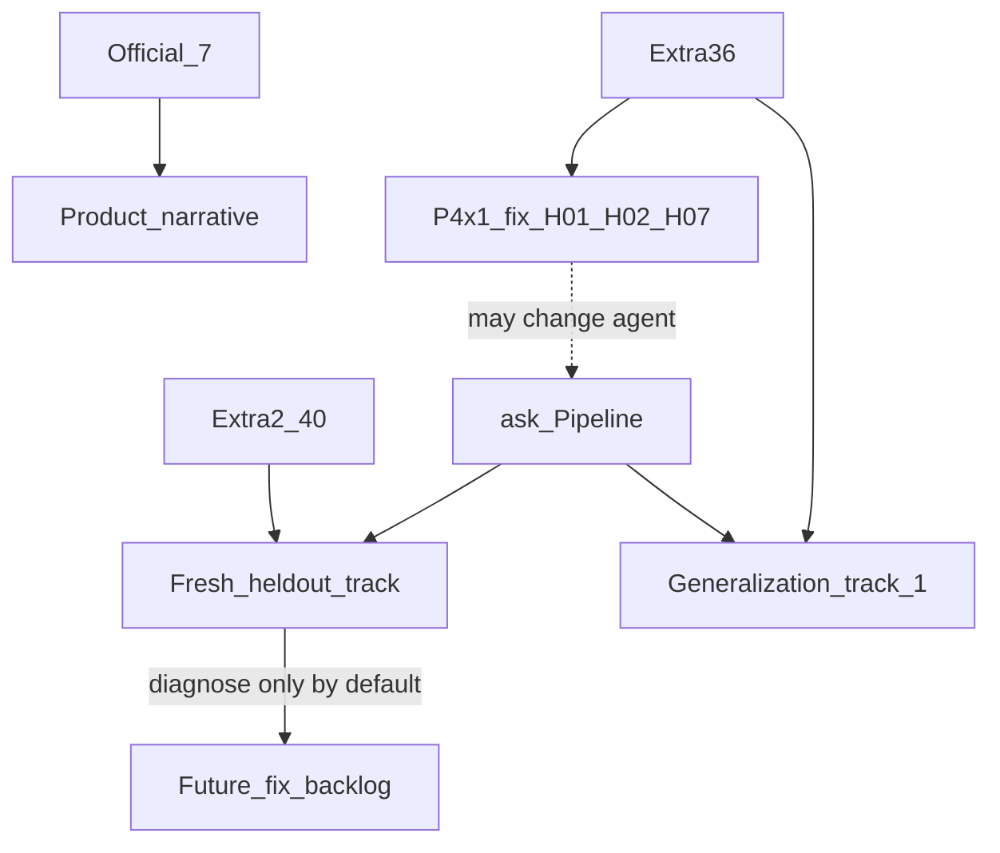
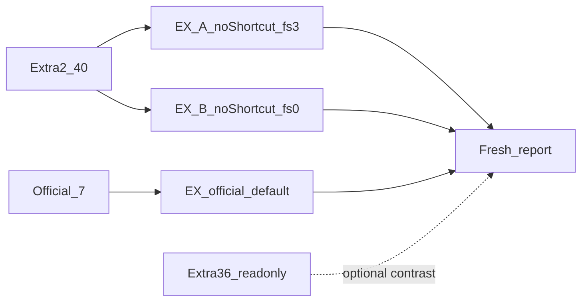

# QueryPilot 阶段四续二：Extra2 清新泛化评测集（约 40 题）

> 记录范围：在**不改**官方 `data/Q&A.xlsx`、**不改**既有 Extra36（`data/extra/`）前提下，新建约 **40** 道 held-out 金标（Extra2），用于**清新**评估当前 Agent 同库泛化；本文为从命题 → 金标 → 评测检验的可执行 SOP。  
> 记录时间：2026-08-09  
> 状态：✅ **S1–S6 已完成** — Extra2-A **35/40（87.5%）**；Extra2-B **33/40（82.5%）**；官方默认 **7/7**；isolation 绿；S6 深度归因见 `logs/eval_reports/extra2_fail_summary.md`。S7 形式收口可选  
> 前置依赖：Extra36 闭环（`logs/03-阶段三续二-*.md`）；评测管线（`load_qa_cases` / `baseline_eval`）；评测时 Agent 已含续一收口（Extra36 A/B 曾 36/36）

---

## 〇、摘要与边界

### 0.1 动机

1. **Extra36 已参与提准闭环**：续一正针对 Extra-B 的 H01/H02/H07 做围栏/Prompt/改写 Few-Shot；继续只在 Extra36 上刷分，**难以区分「真泛化」与「对旧题过拟合」**。
2. **需要清新 held-out**：同 8 表、同口径约定下，另建一套问句与 SQL 骨架尽量不撞车的评测集，做一次「未见过题面」的 EX 抽检。
3. **工程已就绪**：多 path 加载、关短路、`by_difficulty`、报告 stem 均已具备；扩题主成本在人工金标，而非架构改造。
4. **规模**：约 40 题（定 **12:16:12 = 40**），与单域 20～50 常见量级一致，可维护，且相对 Extra36 再增加一倍量级的独立样本。

### 0.2 目标

| 目标 | 说明 |
|------|------|
| 落地 Extra2 **40** 题 | easy:medium:hard = **12:16:12**；主题互补 Extra36 / 官方 7，非克隆骨架 |
| 清新双轨 EX | Extra2-A：关短路 + `max_few_shots=3`；Extra2-B：关短路 + `fs=0` |
| 冻结对照 | 评测时记录 git / Prompt / few-shot 版本；**评测原文永不入 exact 短路** |
| 诊断闭环 | 失败走既有 diagnose / HITL；系统性缺口另开提准（续一或后续），**禁止**为抬分改金标口径放水 |
| 叙事隔离 | Extra2 EX **不替代**官方 7/7 与 Extra36 双轨；答辩作「第二 held-out」附录 |

### 0.3 与相邻阶段边界

| 做 | 不做 |
|----|------|
| 新建 `data/extra2/*.xlsx` + 本题单/矩阵；探数与金标校验脚本（可仿 `data/extra/_*.py`） | **不改**官方 7；**不改** `data/extra/Q&A_*.xlsx`；不改 `data/` 原始 CSV |
| 用现有 `baseline_eval` / `querypilot eval` 跑 Extra2-A/B；官方默认回归 | 不为 Extra2 满分去堆 ReAct / 换默认大模型 |
| 问句去重、与 `examples.yaml` exact 隔离单测（可扩） | 把 Extra2 原文写入 `examples.yaml` exact |
| 文档收口与失败 theme 归因 | 阻塞阶段五 API/UI；重开阶段四压测战役 |
| （可选）失败题改写回流 **candidates** | 本阶段默认**不**为抬 Extra2 分改 L1/Prompt（若续一并行，须在报告注明 Agent 版本） |

### 0.4 与 Extra36 / 续一的关系



| 集合 | 角色 | 本续二态度 |
|------|------|------------|
| 官方 7 | 赛题功能验证 | 只读回归 |
| Extra36 | 第一泛化集；续一提准对象 | 只读；可作「旧集对照」，不合并进 Extra2 |
| Extra2 40 | **清新 held-out** | 本阶段主交付 |
| 续一 | Agent 工程提准 | 并行不阻塞；**造题期间尽量冻结 Agent**；若已合入 P0/P1，报告写明「评测版本含续一修复」 |

### 0.5 成功标准（本阶段 DoD）

1. `data/extra2/Q&A_all.xlsx` 含 **40** 题；难度 12/16/12；`theme` 齐全；id 前缀 `FE`/`FM`/`FH`。  
2. 40 条金标在只读 DuckDB **均可执行**；默认非空（故意测空探针须题注标注）。  
3. 问句与官方 7、Extra36、`examples.yaml` **无全文撞车**；Extra2 原文 exact few-shot **miss**。  
4. 可复现 Extra2-A / Extra2-B 报告于 `logs/eval_reports/extra2_*`；附带官方默认回归不回退。  
5. §五覆盖矩阵每个强制补洞项有题号；Hard 12 槽均有对应题。  
6. 本文进度表勾选；**不以 Extra2 满分作为阶段关门条件**（目标是测准，不是刷满分）。

---

## 一、固定决策

| 项 | 取值 |
|----|------|
| 规模 | **40** = easy **12** + medium **16** + hard **12** |
| 目录 | `data/extra2/`（与 `data/extra/` 并列，避免误改旧集） |
| 落盘文件 | `Q&A_easy.xlsx` / `Q&A_medium.xlsx` / `Q&A_hard.xlsx` / `Q&A_all.xlsx` |
| 表头 | `序号, 问题, SQL, 难度, theme`（同 Extra） |
| id 前缀 | `FE01`–`FE12` / `FM01`–`FM16` / `FH01`–`FH12`（防与 E/M/H 合并撞车） |
| 难度字段 | `简单` / `中等` / `困难` |
| 评测双轨 | **一律** `--no-exact-few-shot`；A：`--max-few-shots 3`；B：`0` |
| 方言 / Join | DuckDB；跨表默认仅 `pty_id` / `org_id`；勿默认 Join `data_dt` |
| 客户快照 | `ads_cust_info_d.data_dt = '20260531'`（与元数据约定一致） |
| 资产口径 | `total_aset = coalesce(nm_tot_aset,0)+coalesce(fc_pur_aset,0)` |
| 盈亏六列 | 对齐 `period_pnl` / Prompt 规则 17（含怪癖符号）；**换客群/换窗**，禁止克隆 Extra H01 / 官方题 3 骨架 |
| Few-Shot | 评测原文不入 exact；可选改写进 `candidates_extra2.yaml` |
| Agent 改动 | 本续二默认 **零**；诊断结论可回喂续一 backlog |

### 1.1 为何不是「再往 Extra36 追加 40 题」

| 方案 | 问题 | 本续二选择 |
|------|------|------------|
| 追加进 `Q&A_all.xlsx` | 旧题已污染提准与 few-shot 叙事；「清新」难以论证 | **独立 Extra2 目录** |
| 替换 Extra36 | 丢失续二可比基线 | 保留 Extra36 不动 |
| 仅改写旧题 | 仍共享 SQL 骨架，held-out 不干净 | 允许少量「同轴新骨架」，禁止 verbatim |

---

## 二、交付成果

| 产物 | 路径 / 形式 | 验收 |
|------|-------------|------|
| 本规划 | `logs/04-阶段四续二-Extra2清新泛化评测集.md` | SOP 可执行 |
| 探数冻结 | `data/extra2/entities.md`（可复用/增量自 `data/extra/entities.md`） | 常量可引用 |
| 三档 + 合并金标 | `data/extra2/Q&A_{easy,medium,hard,all}.xlsx` | 40 题；theme/难度正确 |
| 辅助脚本（可选） | `data/extra2/_build_*.py` / `_explore_*.py` | 生成+加载自检 |
| 隔离测试 | 扩展或新建 `tests/test_extra2_isolation.py` | Extra2 问句 exact miss；与 Extra36 全文不撞 |
| 评测报告 | `logs/eval_reports/extra2_A_fs3.*` / `extra2_B_fs0.*` | JSON+md；含 by_difficulty |
| 官方回归 | `logs/eval_reports/official_p4x2_default.*` | 仍 7/7（默认短路） |
| 失败归因摘要 | 本文 §九 或 `logs/eval_reports/extra2_fail_summary.md` | theme / 错因分层 |
| Few-Shot 候选（可选） | `metadata/few_shots/candidates_extra2.yaml` | 与正式库分离 |

---

## 三、评价方式（清新双轨）



### 3.1 指标解读

| 轨道 | 短路 | fs | 用途 |
|------|------|-----|------|
| Extra2-A | 关 | 3 | **主清新泛化指标**（允许检索改写样例，禁止 exact） |
| Extra2-B | 关 | 0 | 纯 schema/口径/剪枝能力 |
| 官方默认 | 开 | 3 | 产品回归，防造题误伤 |
| （可选）Extra36-A/B | 关 | 3/0 | 同版本 Agent 下旧集对照，观察是否「修旧伤新」 |

| 现象 | 含义 |
|------|------|
| Extra2-A/B 均高 | 同库泛化较扎实 |
| A 高 B 低 | 仍依赖 few-shot 结构提示 |
| Extra36 高、Extra2 低 | **对旧题过拟合**嫌疑上升（本续二核心要回答的问题） |
| 二者均低且错因同族 | 系统性口径/围栏缺口（回喂续一） |

### 3.2 建议命令（工程已具备，路径换成 extra2）

```powershell
# 冒烟（先 limit）
python scripts/baseline_eval.py --path data/extra2/Q&A_all.xlsx --no-exact-few-shot --max-few-shots 3 --limit 3 --stem logs/eval_reports/extra2_smoke_A --no-llm-diagnose

# Extra2-A
python scripts/baseline_eval.py --path data/extra2/Q&A_all.xlsx --no-exact-few-shot --max-few-shots 3 --stem logs/eval_reports/extra2_A_fs3 --no-llm-diagnose

# Extra2-B
python scripts/baseline_eval.py --path data/extra2/Q&A_all.xlsx --no-exact-few-shot --max-few-shots 0 --stem logs/eval_reports/extra2_B_fs0 --no-llm-diagnose

# 官方默认回归
python scripts/baseline_eval.py --stem logs/eval_reports/official_p4x2_default --no-llm-diagnose
```

等价 CLI：`querypilot eval --paths data/extra2/Q&A_all.xlsx --no-exact-few-shot --max-few-shots …`。

### 3.3 目标阈值（检验用，非刷分 KPI）

| 轨道 | 期望（规划口径） | 说明 |
|------|------------------|------|
| Extra2-A | 记录实测；**参考线 ≥90%** 则叙事「清新集仍工业可用」 | 未达不强迫改 Agent；先归因 |
| Extra2-B | 记录实测；与 A 的差距写入报告 | 差距大 → few-shot 依赖 |
| 官方默认 | **7/7** | 硬回归 |

---

## 四、端到端流程（命题 → 评测检验）

### 4.0 步骤总览

```
S0  本文落档 + 冻结 Agent 版本说明
        ↓
S1  覆盖矩阵定稿 + 与 Extra36/官方 去重清单
        ↓
S2  探数 / 实体常量冻结（entities.md）
        ↓
S3  分档命题（意图→问句→金标 SQL）+ 两步校验
        ↓
S4  落盘 xlsx + load_qa_cases 自检 + 隔离测试
        ↓
S5  冒烟评测（limit）→ 全量 Extra2-A/B + 官方回归
        ↓
S6  失败归因（金标 vs Agent）+ 摘要落档；可选 candidates
        ↓
S7  本文勾选收口；数字回填 §九
```

每步均带 **验证**（AGENTS.md 目标驱动）。

---

### S0 — 规划落档与版本冻结

| 动作 | 验证 |
|------|------|
| 确认本文路径与固定决策 | 本文存在；规模=40 |
| 记录评测基准：`git rev-parse --short HEAD`、是否含续一 P0/P1、`examples.yaml` 条数 | 写入 §九「评测环境」表 |
| 约定：造题期不改 `prompt.py` / L1 / few-shot（紧急 bug 除外并记笔记） | 进度表 S0 ✅ |

---

### S1 — 覆盖矩阵与去重门禁

**原则**：按能力轴 A–G **补洞与换骨架**，不是枚举 8 表所有子集。

#### 4.1 能力轴（沿用 Extra，便于对照）

| 轴 | 代号 | Extra2 侧重点（相对 Extra36） |
|----|------|------------------------------|
| Schema/Join | A | 新路径：分公司层级、双维表、持仓×产品×客户三角 |
| 时间语义 | B | 非 Q1 窗、跨月、双快照对比、最新 vs 固定的**新日期对** |
| 指标口径 | C | 净流入、fare/rake 细分、hold_cnt×mkt_val、本币/总资产易混点的**新阈值** |
| 产品与账户 | D | 不同产品名/代码、债券/基金/港股等（以库内实有为准） |
| SQL 结构 | E | 交集 CTE、HAVING 人数两层、Top-N 稳定序、宽投影 |
| 语言泛化 | F | 业务俗称改写；**禁止**与 Extra H11/H12 / 官方题全文同句 |
| 营销组合 | G | 新交叉：地域×信用、年龄×佣金、职业×资金流×持仓等 |

#### 4.2 强制去重门禁（写题前 / 合入前）

| 检查 | 标准 |
|------|------|
| 问句全文 | ≠ 官方任一题；≠ Extra36 任一题；≠ `examples.yaml` 任一 `question` |
| SQL 骨架 | Hard 不得整段复制 Extra H01–H12 / 官方 3/5/6/7 的 CTE 结构后仅改常量 |
| 实体 | 产品名、阈值、省份等尽量换一批（见 entities 冻结表「Extra2 专用」列） |
| theme | 可与 Extra 同名轴，但 id/问法/主实体必须新 |

**验证**：维护 `data/extra2/dedupe_checklist.md`（或脚本 diff 问句集合）→ 0 冲突。

#### 4.3 Extra2 强制补洞（相对 Extra36 再铺一层）

| 补洞项 | 最低题量 | 建议题号 |
|--------|----------|----------|
| 客户类型 / 非「正常」状态以外的字典维 | ≥1 | FE01–FE02 |
| 城市（非仅省）或分公司 `up_org_*` | ≥2 | FE08–FE09, FM13 |
| 手续费 `buy_fare`/`sell_fare`（非仅 rake） | ≥1 | FM05 |
| 证券转入转出 `assign_in`/`assign_out` | ≥1 | FM08 |
| 持仓+交易**同一产品**（非 A 交易 B 持仓） | ≥1 | FM10, FH10 |
| 两段时间窗对比（如 Q1 vs 另一窗指标差） | ≥1 | FH09 |
| 「有多少人」两层 COUNT + HAVING | ≥2 | FM03, FH07 |
| 空结果探针（可选，≤1，须标注） | ≤1 | FE12 或跳过 |
| 改写稳健性（相对官方或 Extra 中题，**新表述**） | ≥2 | FH11, FH12 |
| 盈亏六列**新客群**（非银卡×A股×1000 克隆） | ≥1 | FH01 |
| Top-N **客户**（非仅营业部）+ 稳定二级序 | ≥1 | FH07 |

---

### S2 — 探数与实体冻结

| 动作 | 验证 |
|------|------|
| 复用 `data/extra/entities.md`，增量探：城市、up_org、fare、assign、新产品名、可使结果非空的阈值 | 产出 `data/extra2/entities.md` |
| 脚本可选：`PYTHONPATH=. python data/extra2/_explore.py` | 关键 COUNT > 0 |
| 冻结「Extra2 专用」实体表（产品 A/B、等级、窗、阈值） | 写题只引用冻结常量 |

**非空策略**：阈值导致 0 行 → 降阈值或换实体；故意空结果须 theme=`empty_probe` 且题注说明。

---

### S3 — 分档命题与金标两步校验

**单题工作流**：

1. 按 §五题号填：theme、意图、主考轴、冻结实体。  
2. 写问句（业务口语，避免直接粘贴列英文名堆砌）。  
3. 写金标 SQL（只读；投影列与题面一致）。  
4. **校验①**：DuckDB 执行 → 看行数与样例行。  
5. **校验②**：可选对单题 `ask`（关短路）对照——**失败先判金标再判 Agent**。  
6. 过门禁：去重 + theme + 难度 + 非空策略。

#### 口径纪律（继承 Extra §4.2，摘要）

1. Join 默认业务键；客户表钉 `20260531`。  
2. 产品类过滤必须 `JOIN dim_product`。  
3. `dim_public` 必须带 `code_type_id`。  
4. 日均：区间每日总资产之和 / 日历天数；过滤器进入最终结果路径。  
5. 期间盈亏：对齐 metrics；换客群不自创符号规则。  
6. Top-N：`ORDER BY metric DESC, stable_key`。

---

### S4 — 落盘与工程自检

| 动作 | 验证 |
|------|------|
| 生成分档 xlsx + `Q&A_all.xlsx`（顺序 FE→FM→FH） | `load_qa_cases` → 40；id 唯一 |
| `tests/test_extra2_isolation.py`（或扩现有 isolation） | Extra2 问句对 `find_exact_few_shot` 全 miss；与 Extra36 问句集合无交集 |
| 全量 `pytest` 绿 | 不破坏旧测试 |
| 更新 `data/extra2/README.md`（仿 extra README） | 表头/题量说明齐全 |

**工程改动预期**：**接近零**（仅新数据文件 + 可选薄测试/探数脚本）。无需改 `EXPECTED_TABLES`、Pipeline、L1。

---

### S5 — 评测检验

| 顺序 | 动作 | 验证 |
|------|------|------|
| 5.1 | `--limit 3` 冒烟 A | 报告可写；无加载错误 |
| 5.2 | 全量 Extra2-A | `extra2_A_fs3.json`；记录 accuracy / by_difficulty / p50/p95 |
| 5.3 | 全量 Extra2-B | `extra2_B_fs0.json`；同上 |
| 5.4 | 官方默认回归 | 7/7 |
| 5.5 | （可选）同版本复跑 Extra36-A 抽检或全量 | 对照「修旧伤新」 |
| 5.6 | 环境表回填 §九 | commit、模型名、fs、是否续一已合入 |

失败题：`--diagnose` 或已有 review 队列；**本阶段默认不改 Agent**。

---

### S6 — 归因与回流（可选）

| 动作 | 验证 |
|------|------|
| 按 theme / 轴归类失败 | 摘要 md |
| 金标错 → 修 Extra2 xlsx 后重跑子集 | 修复有 diff 说明 |
| Agent 系统错 → 记入续一或新 backlog（L1/Prompt/剪枝） | **不**在本续二静默改 Prompt 刷分 |
| 可选：≤5 条**改写**问句入 `candidates_extra2.yaml` | isolation 仍保证评测原文 miss |

---

### S7 — 收口

| 动作 | 验证 |
|------|------|
| DoD 清单勾选 | §0.5 全满足 |
| 答辩三句话写入 §十 | 含「Extra2 与 Extra36 对比」一句 |
| 不把 Extra2 100% 写进阶段五主叙事替代官方/Extra36 | 阶段五仍主引旧双轨；Extra2 作附录 |

---

## 五、题单骨架（写题清单）

> 落地时：阈值/产品名以 DuckDB 实有为准微调；**意图与主考轴不变**。  
> 写题前先填实体冻结表，再填 SQL。

### 5.1 Easy（FE01–FE12）— 单表或事实+维表

| ID | theme | 意图（一句话） | 主考轴 |
|----|-------|----------------|--------|
| FE01 | cust_type_filter | 某客户类型（cust_type / 字典）客户人数 | A, F |
| FE02 | status_alt | 非「正常」的某一高频账户状态人数 | A, F |
| FE03 | age_band_count | 仅按年龄段（如 [40,50)）计客户数，无资产 | A |
| FE04 | city_cust_count | 按**城市**统计客户数（Top 或指定市） | A |
| FE05 | nm_bal_threshold | 普通账户现金余额超阈值的客户人数 | C, D |
| FE06 | fc_bal_threshold | 信用/外币余额相关字段超阈值（题注写清列） | C, D |
| FE07 | hold_mkt_val | 持仓市值合计超阈值的客户数（不限产品） | C, D |
| FE08 | branch_name_count | 指定营业部名称下的客户数 | A |
| FE09 | up_org_count | 指定分公司（up_org_name）下客户数 | A |
| FE10 | gender_level | 某等级×性别人数（换 Extra E10 实体） | A, F |
| FE11 | product_name_hold | 持有**新**产品名的客户数（换 Extra 产品） | D |
| FE12 | edu_alt_set | 另一学历集合（如大专及以下）客户人数 | A, F |

### 5.2 Medium（FM01–FM16）— 单轴做透，2～3 表

| ID | theme | 意图（一句话） | 主考轴 |
|----|-------|----------------|--------|
| FM01 | fc_hold_alt | 信用账户持有**另一**产品的客户 | D |
| FM02 | fc_tran_window | 非 Q1 窗内信用账户交易额>阈值 | D, B, C |
| FM03 | sell_hav_count | 窗内卖出金额 HAVING 后**有多少人**（两层 COUNT） | C, E |
| FM04 | buy_amt_window | 自定义窗买入金额>阈值客户列表 | C, B |
| FM05 | fare_sum | 窗内买卖**手续费**合计超阈值 | C |
| FM06 | ccy_group | 按币种分组持仓市值 | D |
| FM07 | cash_net_in | 窗内现金净流入（in−out）较大客户 | C, B |
| FM08 | assign_flow | 证券转入或转出较大的客户 | C, B |
| FM09 | bond_or_fund | 持仓属于债券/基金等（库内有的类）市值 | D |
| FM10 | same_prdt_trade_hold | **同一**产品既有交易又有持仓的客户 | D, E |
| FM11 | nm_tot_only | 明确只用 nm_tot_aset 门槛（禁止加成 fc） | C |
| FM12 | custom_avg_window | 非官方/Extra 常用的日均资产窗 | B, C |
| FM13 | up_org_trade | 按分公司汇总窗内交易额 | A, G |
| FM14 | latest_aset_alt | 「最新」总资产超阈值客户（MAX data_dt） | B, C |
| FM15 | prov_aset_dist | 省份×总资产门槛的人数分布 | G, A |
| FM16 | sor_prdt_tran | 按 sor_prdt_id 筛选窗内交易客户 | D, F |

### 5.3 Hard（FH01–FH12）— 多轴交叉

| ID | 槽位 | theme | 意图（一句话） | 主考轴 |
|----|------|-------|----------------|--------|
| FH01 | 盈亏新客群 | period_pnl_fresh | 新等级/地域/持股条件 × Q1（或新窗）盈亏六列 | C, E, G |
| FH02 | 日均∧持仓类 | avg_hold_taxonomy | 日均∧持仓一级类人数或分布（过滤进最终路径） | C, D, E |
| FH03 | 年龄×资产×市 | age_aset_city | 年龄段×总资产×城市（或省）交叉 | G, A |
| FH04 | 净流入∧交易 | fin_and_tran | 大额净流入且窗内有股票交易的客户 | C, G, E |
| FH05 | 信用×产品类×窗 | fc_type_window | 信用+产品大类+时间窗聚合 | D, B, E |
| FH06 | 佣金×等级×组织 | rake_level_org | 高等级客户高佣金之营业部分布 | C, G |
| FH07 | Top-N 客户 | topn_cust | 窗内交易额 Top-N **客户** + 稳定二级序 | E, G |
| FH08 | 宽投影 | wide_proj_fresh | ≥4 列明确投影，无多余 COUNT | E, F |
| FH09 | 双窗对比 | two_window_cmp | 两段窗指标对比或差集圈选 | B, C, E |
| FH10 | 同产品交易持仓∧属性 | same_prdt_attr | 同产品交易∩持仓再叠加性别/等级 | D, G, E |
| FH11 | 改写稳健 | paraphrase_fresh_1 | 官方或 Extra 中题之**新**同义问法 | F |
| FH12 | 改写稳健 | paraphrase_fresh_2 | 另一道改写（建议日均/Top-N/盈亏话术） | F, C |

### 5.4 题号 × 轴速查（验收）

| 轴 | Easy | Medium | Hard |
|----|------|--------|------|
| A | FE01–FE04, FE08–FE10, FE12 | FM13, FM15 | FH03 |
| B | — | FM02, FM04, FM07–FM08, FM12, FM14 | FH05, FH09 |
| C | FE05–FE07 | FM03–FM05, FM07–FM08, FM11–FM12 | FH01–FH02, FH04, FH06, FH12 |
| D | FE05–FE07, FE11 | FM01–FM02, FM06, FM09–FM10, FM16 | FH02, FH05, FH10 |
| E | — | FM03, FM10 | FH01–FH02, FH04–FH05, FH07–FH10 |
| F | FE01–FE02, FE10, FE12 | FM16 | FH08, FH11–FH12 |
| G | — | FM13, FM15 | FH01, FH03–FH07, FH10 |

---

## 六、工程改动要点（预期极小）

| 项 | 需要？ | 说明 |
|----|--------|------|
| `load_qa_cases` / runner / CLI | 否 | 已支持 `--path` / `--paths` |
| Pipeline / L1 / Prompt | 默认否 | 清新评测期冻结 |
| 新测试 | 建议是 | Extra2 问句 exact isolation + 与 Extra36 问句无交集 |
| 探数/建 xlsx 脚本 | 可选 | 降低手工错误，非架构依赖 |
| `EXPECTED_TABLES` / CSV | 否 | 仍 8 表 |

---

## 七、进度记录

| 步骤 | 状态 | 一句话 |
|------|------|--------|
| S0 本文规划落档 | ✅ | 流程与题单骨架已定 |
| S1 矩阵/去重清单 | ✅ | `data/extra2/dedupe_checklist.md`；与官方/Extra36/few-shot 55 条占用问句比对 |
| S2 探数 entities | ✅ | `_explore.py` + `entities.md`；assign 全库为 0 → FM08 冻结为 cnt=0 |
| S3 命题+金标 SQL | ✅ | 12+16+12；`_build_extra2.py` 40/40 可执行；问句去重通过 |
| S4 xlsx + isolation | ✅ | `tests/test_extra2_isolation.py` 3 passed；eval 相关 pytest 42 passed |
| S5 Extra2-A/B + 官方回归 | ✅ | A 35/40；B 33/40；官方 7/7；报告见 `logs/eval_reports/extra2_*` |
| S6 归因摘要 / candidates | ✅ | `logs/eval_reports/extra2_fail_summary.md`；主责=剪枝×L1 允许表 + 元数据/Prompt；未回流 candidates |
| S7 收口勾选 | ⏳ | 主数字与归因已齐；形式 DoD 勾选可随后 |

### S3 造题摘记（2026-08-09）

| 项 | 结果 |
|----|------|
| 落盘 | `data/extra2/Q&A_{easy,medium,hard,all}.xlsx` |
| 校验① | 40 条 DuckDB 执行通过；FM08 故意 `cnt=0`（考 `assign_in`） |
| 去重 | 与占用问句全文 0 冲突 |
| 主实体换批 | 销户/南京市/金卡女/南方天天利/江特电机/特变电工/利欧股份/`002131`；盈亏客群=白金×创业板 |
| 重建命令 | `PYTHONPATH=. python data/extra2/_build_extra2.py` |

### S4–S5 摘记（2026-08-09）

| 项 | 结果 |
|----|------|
| Isolation | Extra2 exact few-shot 全 miss；与 Extra36 问句无交集；40 题 id/难度形状正确 |
| 冒烟 | `extra2_smoke_A` limit=3 可写报告（加载 OK） |
| Extra2-A | **35/40 = 87.5%**（易 10/12 · 中 15/16 · 难 10/12）；p50/p95 ≈ 3169 / 5700 ms |
| Extra2-B | **33/40 = 82.5%**（易 11/12 · 中 13/16 · 难 9/12）；p50/p95 ≈ 3533 / 7464 ms |
| 官方默认 | **7/7 = 100%** |
| 对照结论 | Extra36 满分 ≠ Extra2 满分 → **旧集过拟合风险被清新集证实**；未改 Agent 刷分 |

---

## 八、风险与回退

| 风险 | 缓解 |
|------|------|
| 新题与 Extra36「换汤不换药」 | 去重门禁 + Hard 禁克隆骨架；实体换一批 |
| 造题期 Agent 被续一改动，结果不可比 | §九 记录 commit；报告标题注明版本 |
| 金标口径漂移导致假失败 | 两步校验；失败先审金标 |
| 为冲 90% 改 Prompt 污染「清新」叙事 | 默认禁止；提准另记续一/后续 |
| 评测原文进 exact 短路 | isolation 测试门禁 |
| 40 题维护成本 | 分档文件；theme 归因；不做 100+ | 

**回退**：xlsx 质量不足 → 停在 S3 修金标，不进入全量叙事；评测脚本失败 → 先 `--limit` 修加载。

---

## 九、评测环境与结果回填（落地后填）

### 9.1 环境

| 项 | 值 |
|----|-----|
| 日期 | 2026-08-09 |
| git short SHA | `7bfa07b` |
| 模型 | `deepseek-chat` |
| 是否含续一 P0/P1/P2 | **是**（续一日志已收口 Extra36 A/B 36/36） |
| `examples.yaml` 条数 | 15 |
| DuckDB 路径 | `db/competition.duckdb` |

### 9.2 结果表（S5 基线 → 提准后）

**S5 冻结基线（提准前）**

| 轨道 | 产物 | EX | by_difficulty | p50 / p95 total_ms | 失败 id |
|------|------|----|---------------|--------------------|---------|
| Extra2-A fs3 | `extra2_A_fs3.*` | **35/40 = 87.5%** | 易 83.3% · 中 93.8% · 难 83.3% | 3169 / 5700 | FE01, FE09, FM08, FH02, FH04 |
| Extra2-B fs0 | `extra2_B_fs0.*` | **33/40 = 82.5%** | 易 91.7% · 中 81.3% · 难 75.0% | 3533 / 7464 | FE09, FM05, FM07, FM08, FH02, FH04, FH12 |
| 官方默认 | `official_p4x2_default.*` | **7/7 = 100%** | — | 3670 / 4981 | — |

**提准后复测（P0–P2 + `pnl_fix` FH01）**

| 轨道 | 产物 | EX | p50 / p95 total_ms | 失败 id |
|------|------|----|--------------------|---------|
| Extra2-A fs3 | `extra2_A_fs3_final2.*` | **40/40 = 100%** | 3110 / 5111 | — |
| Extra2-B fs0 | `extra2_B_fs0_final2.*` | **40/40 = 100%** | 3118 / 4408 | — |
| 官方默认（开短路） | `official_default_check.*` | **7/7 = 100%** | 2919 / 4244 | — |
| 官方关短路 fs3 | `official_noshort_fs3.*` | **6/7 = 85.7%** | 3636 / 5270 | **6**（金标 quirk，见下） |

### 9.3 对照解读

- **Extra36-A vs Extra2-A（S5）**：旧集关短路满分 → 清新集曾 **87.5%**，说明对 Extra36 存在同库过拟合。
- **提准后**：Extra2-A/B 均 **40/40**；官方默认仍 **7/7**。清新集缺口（剪枝 hub、枚举渲染、`tran_in` 金标、手续费别名、净流入/双窗、盈亏列 rewrite）已按 S6 优先级合入。
- **官方关短路 Q6**：pred=24 / gold=25。金标定义了未使用的 `cust_avg_30` CTE，最终只从 `cust_tran` 取客；语义正确的「日均资产∩股票交易」交集少 1 个产品类型（货币式基金/货币市场基金）。**不改官方金标**；开短路仍 7/7。详见 `official_noshort_fs3_review.json`。
- **主要修复（相对 S6 backlog）**：
  1. **P0** `schema_pruner`：客户线索 + `dim_branch` 时注入 `ads_cust_info_d`。
  2. **P1** `bundle` 渲染 `enum_values` / `cust_type`；FM08 金标→`tran_in`；fare 别名 + Prompt 规则。
  3. **P2** 净流入 / 双窗 JOIN 等 Prompt 规则（错误集 8/8 后合入）。
  4. **FH01 fs0** `pnl_fix`：CTE 已暴露 nm/fc 但外层误用 `b.bgn_aset` 时重写为 nm+fc 与金标 `aset_pft` quirk。

### 9.4 S6 版块定位一览

| 排序 | 版块 | 关键路径 | 代表题 | 提准后 |
|------|------|----------|--------|--------|
| 1 | Schema 剪枝 + Pipeline 允许表 | `schema_pruner.py` / `pipeline.py` | FE09 | ✅ |
| 2 | 元数据 YAML + Schema 渲染 | `bundle.py` / `ads_cust_info_d.yaml` | FE01, FM08 | ✅ |
| 3 | System Prompt / Few-Shot | `prompt.py` / fare aliases | FH02, FM05 | ✅ |
| 4 | LLM 生成 + 确定性 rewrite | `prompt.py` / `pnl_fix.py` | FH04, FM07, FH01 | ✅ |

---

## 十、答辩话术（收口后可引用）

1. **清新 held-out**：Extra2（40 题）关短路双轨；S5 基线 A/B 曾 87.5%/82.5%，提准后 **40/40**；官方默认仍 7/7，专门回答「是否只过拟合旧题」。  
2. **工程代价低**：复用既有 EX 管线与元数据约定；S4 isolation 保证评测原文不进 exact 短路。  
3. **提准路径可复盘**：失败族按剪枝 hub → 枚举渲染 → 列义/Prompt → 盈亏 rewrite 收敛；官方关短路 Q6 为金标未使用 CTE 的 quirk，不以过拟合 rewrite 强刷。

---

## 十一、建议排期

| 顺序 | 工作量 | 产出 |
|------|--------|------|
| Day 0 | S0–S1 | 矩阵与去重清单 |
| Day 1 | S2 + Easy 12 + Medium 半 | entities + 部分 xlsx |
| Day 2 | Medium 完 + Hard 12 | 金标两步校验齐 |
| Day 3 | S4–S5 | isolation + 全量 A/B + 官方回归 |
| Day 3–4 | S6–S7 | 归因摘要与本文回填 |

可与续一 **串行更佳**（先冻结版本跑 Extra2，或先合入 P0 再跑并注明）；并行时必须分报告文件名，避免互相覆盖 stem。

---

## 十二、关键路径速查

| 类型 | 路径 |
|------|------|
| 本规划 | `logs/04-阶段四续二-Extra2清新泛化评测集.md` |
| Extra2 数据 | `data/extra2/`（xlsx + entities + build） |
| Isolation | `tests/test_extra2_isolation.py` |
| 评测报告 | `logs/eval_reports/extra2_A_fs3.*`、`extra2_B_fs0.*`、`official_p4x2_default.*` |
| Extra36（只读对照） | `data/extra/Q&A_all.xlsx` |
| 官方（只读） | `data/Q&A.xlsx` |
| 评测入口 | `scripts/baseline_eval.py`、`querypilot eval` |
| 加载 | `querypilot/eval/dataset.py` |
| 上游 | `logs/03-阶段三续二-Extra金标扩充与泛化评测.md` |
| 并行提准 | `logs/04-阶段四续一-Extra泛化提准与低延迟优化.md` |
| 下游交付 | `logs/05-阶段五-原型系统交付与验证.md`（Extra2 作附录，不替换主双轨） |
